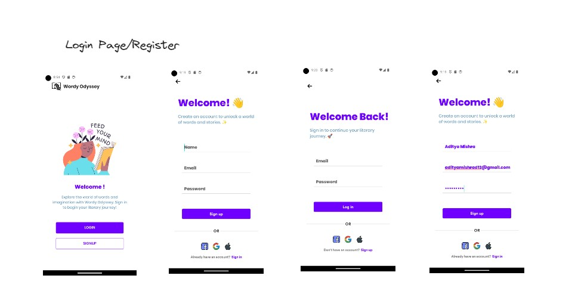
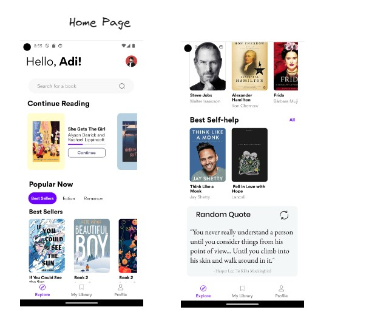
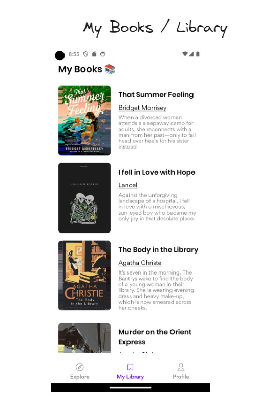
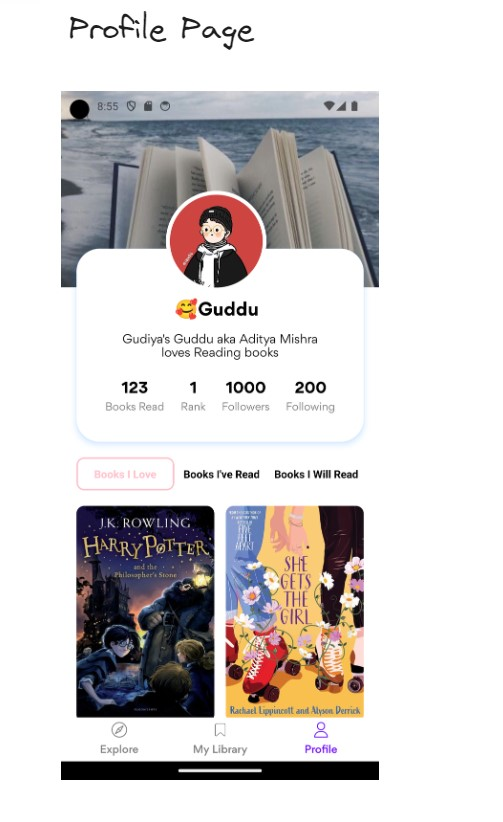
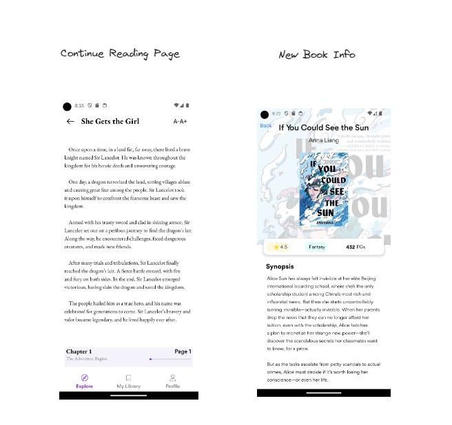

<!-- 

  <a href="#calling-about">About</a>&nbsp;&nbsp;&nbsp;|&nbsp;&nbsp;&nbsp;
  <a href="#eyes-preview">Preview</a>&nbsp;&nbsp;&nbsp;|&nbsp;&nbsp;&nbsp;
  <a href="#gear-core-tech-stack">Tech Stack</a>&nbsp;&nbsp;&nbsp;|&nbsp;&nbsp;&nbsp;
  <a href="#sparkles-main-features">Features</a>&nbsp;&nbsp;&nbsp;|&nbsp;&nbsp;&nbsp;
  <a href="#camera_flash-screenshots">Screenshots</a>&nbsp;&nbsp;&nbsp;|&nbsp;&nbsp;&nbsp;
  <a href="#memo-license-">License</a>&nbsp;&nbsp;&nbsp;|&nbsp;&nbsp;&nbsp;
  <a href="#warning-disclaimer">Disclaimer</a>

 -->

<h1 align="center">
 📖🖼 <em>Wordy Odyssey </em>
</h1>

  

 

## :calling: About

Wordy Odyssey is a versatile book discovery and management app that takes you on a literary journey reminiscent of popular book-related platforms like Goodreads and Audible. This app offers a plethora of features designed to enhance your reading experience.

At the heart of Wordy Odyssey is its powerful book search functionality, allowing users to explore the latest literary gems. With a simple search using keywords, book titles, or authors, you can dive into a world of books tailored to your preferences. The search results provide a curated list of the most relevant and trending books, ensuring you never miss out on the next captivating read.

To make your experience truly personalized, Wordy Odyssey offers a robust user registration and login system. Create your unique profile, complete with a customizable avatar, and embark on your reading journey with a touch of individuality. Connect with fellow book enthusiasts, share your literary adventures, and see what your friends are reading.

Wordy Odyssey goes beyond the standard bookshelf. It lets you curate your reading lists, making it easier than ever to keep track of books you want to read, have already read, or wish to recommend to others. Organize your literary treasures into lists that reflect your reading goals, whether it's a "To-Read" list or a collection of all-time favorites.

But the features don't stop there. Wordy Odyssey also keeps you engaged with its innovative social aspect. Discover what your friends are reading and exchange recommendations. Engage in discussions, share reviews, and create a vibrant community of book lovers.

And that's not all; Wordy Odyssey is continually evolving, with more exciting features on the horizon. Stay tuned for updates that will enhance your reading experience, making Wordy Odyssey your go-to app for all things literary. Whether you're a casual reader or a devoted bookworm, Wordy Odyssey is your companion on this word-filled odyssey.

## :eyes: Preview

    
   
   
   
   

## :gear: Core Tech Stack

👉&nbsp; [Project Architecture Diagram](https://lucid.app/lucidchart/invitations/accept/inv_6fab6816-4e33-4ab2-9039-1cab4f972b3d "YumMeals App Architecture Diagram")

- :arrow_up_small:&nbsp; [Expo](https://expo.io/ "Expo")
- :electron:&nbsp;[React Native](https://reactnative.dev/ "React Native")
- :page_with_curl:&nbsp; [React Native Paper](https://callstack.github.io/react-native-paper/index.html "React Native Paper")
- :link:&nbsp; [React Navigation](https://reactnavigation.org/ "React Navigation")
- :performing_arts:&nbsp; [Styled Components](https://styled-components.com/ "Styled Components")
- :fire:&nbsp; [Firebase Authentication & Cloud Functions](https://firebase.google.com/)
- :credit_card:&nbsp; [Stripe Payment API](https://stripe.com/docs/payments "Stripe Payments")
- :world_map:&nbsp; [Google Places APIs](https://developers.google.com/maps/documentation/places/web-service/overview "Google Places APIs")

## :sparkles: Main Features

Wordy Odyssey offers a comprehensive set of features designed to cater to book enthusiasts and enhance their reading experience. Here are the main features of the app:

1. **Book Discovery:** Search for and discover the latest and most popular books using keywords, titles, or authors.

2. **User Registration:** Create a personalized profile by registering an account, complete with a customizable avatar.

3. **User Authentication:** Secure user login authentication to protect your personal information and reading preferences.

4. **Friend Network:** Connect with friends and fellow readers to see what they are reading, share recommendations, and foster a literary community.

5. **Reading Lists:** Create and manage reading lists, including "To-Read," "Currently Reading," and "Read" lists to organize your book collection.

6. **Book Recommendations:** Get personalized book recommendations based on your reading history and preferences.

7. **Book Reviews:** Share your thoughts and opinions on books you've read, and read reviews from other users to make informed choices.

8. **Social Interaction:** Engage in discussions, comment on book reviews, and interact with other users who share your literary interests.

9. **Notifications:** Receive updates on new releases, book discussions, and friend activity to stay connected with the reading community.

10. **Profile Customization:** Personalize your user profile with avatars and other customizable elements.

11. **Book Details:** Access detailed information about books, including summaries, author bios, and reader reviews.

12. **Reading Challenges:** Set and track reading goals, participate in reading challenges, and earn badges for achievements.

13. **Bookstore Integration:** Seamlessly purchase or download books directly from the app's integrated bookstore.

14. **Community Engagement:** Join or create reading groups and clubs to discuss books with like-minded individuals.

15. **Offline Reading:** Download books for offline reading convenience.

16. **Cross-Platform Sync:** Sync your reading progress and preferences across multiple devices for a seamless experience.

17. **Accessibility Features:** Ensure inclusivity with features like adjustable font sizes and audio narration options.

18. **Explore Genres:** Discover books from a wide range of genres, from fiction to non-fiction, fantasy to romance.

19. **Bookmarks and Annotations:** Add bookmarks and annotations to your eBooks for easy reference and note-taking.

20. **Privacy Settings:** Manage your privacy settings and control the visibility of your reading activity.

21. **Push Notifications:** Receive timely updates about book releases, author events, and friend activity through push notifications.

22. **Feedback and Support:** Provide feedback, report issues, and access customer support for assistance.

23. **Future Updates:** Stay tuned for regular app updates, introducing new features and improvements to enhance your reading experience.

Wordy Odyssey is your one-stop destination for everything related to books, offering a vibrant and engaging platform for readers of all interests and levels.

# :closed_book:

Made with 💖 by [**Aditya Mishra**](https://www.linkedin.com/in/adityad12/) 🚀
