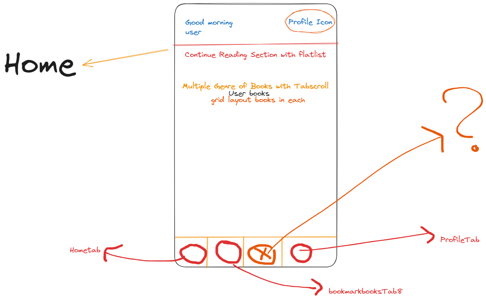

# To Do



## add Hd books cover

## Project Structure on Flat Design

```
├───android
├───ios
├───src
│   ├───screens
│   │   ├───detail
│   │   │   ├───DetailScreen.style.ts
│   │   │   └───DetailScreen.tsx
│   │   ├───home
│   │   │   ├───HomeScreen.style.ts
│   │   │   └───HomeScreen.tsx
│   │   ├───notification
│   │   │   ├───NotificationScreen.style.ts
│   │   │   └───NotificationScreen.tsx
│   │   ├───profile
│   │   │   ├───ProfileScreen.style.ts
│   │   │   └───ProfileScreen.tsx
│   │   └───search
│   │       ├───SearchScreen.style.ts
│   │       └───SearchScreen.tsx
│   ├───services
│   │   ├───api
│   │   │   ├───api.constant.ts
│   │   │   └───index.ts
│   │   ├───event-emitter
│   │   │   └───index.ts
│   │   ├───models
│   │   │   └───index.ts
│   │   └───navigation
│   │       └───index.tsx
│   ├───shared
│   │   ├───components
│   │   │   └───text-wrapper
│   │   ├───constants
│   │   │   └───index.ts
│   │   ├───localization
│   │   │   └───index.ts
│   │   └───theme
│   │       ├───fonts.ts
│   │       └───themes.ts
│   └───utils
│       └───index.ts
├───.babelrc
├───.commitlintrc.json
├───.eslintignore
├───.eslintrc.js
├───.gitattributes
├───.gitignore
├───.npmignore
├───.prettierignore
├───.prettierrc
├───.watchmanconfig
├───app.json
├───App.tsx
├───global.d.ts
├───index.js
├───metro.config.js
├───package-lock.json
├───package.json
├───react-native.config.js
├───README.md
├───tsconfig.json
```
